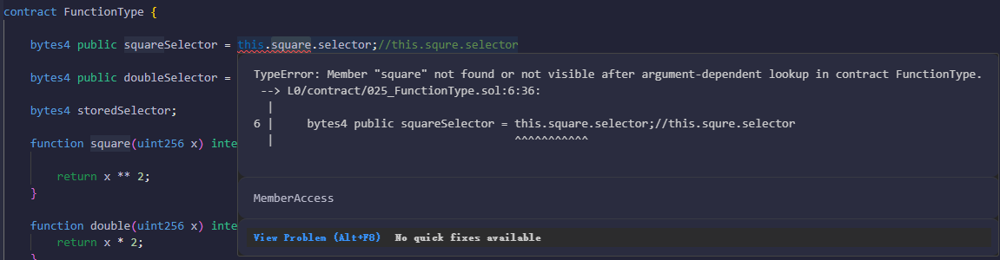

### 什么是区块？包含了哪些数据？

区块是区块链的基本组成单元，存储数据交易和其他信息的数据包。

- 区块头：包含了多项重要信息，如父区块的哈希值、叔区块的哈希值（uncles hash）、状态树根哈希（state root）、交易树根哈希（tx root）、收据树根哈希（receipt root）、时间戳、随机数等。

```text
parentHash：前一个区块（父区块）的 256 位哈希值。
ommersHash：与该区块关联的 uncle 区块的 256 位哈希值。
beneficiary：接收交易费的矿工的以太坊地址。
stateRoot：在区块中所有交易执行完成且区块被确认后，状态树根节点的 256 位哈希值。
receiptRoot：区块中所有交易收据所组成的树的根节点的 256 位哈希值。
transactionRoot：区块中所有交易所构成的树的根节点的 256 位哈希值。
logsBloom：区块中所有交易收据的日志所组成的 Bloom 过滤器。
difficulty：区块的难度值，根据父区块的难度值和时间戳计算得到。
number：区块的高度，其中创世区块高度为 0。
GasLimit：区块中可用的最大 Gas 量，根据父区块的 GasUsed 与 GasLimit * 2/3 计算得到。
GasUsed：区块中所有交易消耗的 Gas 总量。
timestamp：区块生成的时间戳。
extraData：区块的附加数据，最长 32 字节。
mixHash：一个 256 位哈希值，与 nonce 共同用于证明当前区块执行了足够的计算量。
nonce：工作量证明过程中生成的一个 64 位哈希值，与 mixHash 一起用于证明当前区块的计算量。
```

- 交易列表：由矿工从交易池中筛选并打包的一系列交易哈希构成，这些是在该区块生成期间被确认的交易。
- 叔区块头：指那些未能成为主链一部分但被主链区块引用的区块。每个主链中的区块最多可以引用两个叔区块。

BTC和以太坊的区块数据有些区别？ 以太坊因为15s左右出块，因此很容易产生分叉，结构中包含一个uncles节点相关信息。

- **区块头(Block Header)**
  
  - 版本号
  - 前一个区块hash值
  - Merkle root 本区块所有交易的hash摘要
  - nonce 随机数
  - 时间戳
  - 难度目标
  - 随机数(nonce)

- **交易数据(Block Body)**
  
  - 区块所有交易(转账、智能合约)
  - 整个区块大小1M（约1000000bytes），每个交易大概250bytes, 大概有2000-3000(4000)个交易

- **其他元数据**

  - 区块高度
  - 旷工签名

### 什么是交易？交易执行之后产生什么样的影响？

交易是区块链网络中记录价值转移或智能合约操作的核心单元，是用户与链上协议交互的基础方式。

- 创建交易
- 交易签署，交易重放(签名时添加链标识符chainId)
- 交易广播
- 交易提交 queue、pending列表。先进入queue，满足一定条件，进入pending
- 交易执行
- 交易存储 收据，记录交易对账户状态做的更改

### 什么是账户(Account)？什么是合约？怎么调用合约？调用合约之后怎么查询合约中的数据？

Account 是参与链上交易的基本角色，是 Ethereum 状态机模型中的基本单位，承担了链上发起者以及接受者的角色。以太坊中账户分为

- 外部账户(EOA)：由用户直接控制的账户，负责签名并发起交易。通过控制私钥保证对用户数据的控制权。
  - 本地创建
    - 创建新的EOA账户，随机获取私钥(32bytes,64位16进制数)
    - 使用私钥计算公钥与地址。使用ECDSA算法。
    - 对私钥椭圆加密，获得64bytes的数，由两个32bytes组成，spec256k1曲线上的xy轴
    - 最终账户地址，是基于公钥进行Keccak-256算法计算之后得到的哈希值后20个字节
  - 链上注册
- 合约账户(Contract)：简称合约，由外部账户通过 tx 创建。合约账户保存了不可篡改的图灵完备的代码段，以及一些持久化的数据变量。
  - 变量对应存储层的slot 是按照其在合约中的声明顺序，从第一个(position:0)开始分配
  - 对于固定长度的变量，其值锁占用的Slot的位置在合约初始化开始的时候就已经分配了。
  - 两个小于 32bytes 长的变量合并到一个slot做法节省空间

StateObject StateDB Tire

合约地址和合约ABI创建对应的合约并调用

合约中的只读函数或者 public 变量查询合约中的数据

### 交易作用？交易的Receipt包含哪些数据？

- 交易作用
  - 在 Layer-1 网络上的 Account 之间进行 Native Token 的转账
  - 创建新的 Contract
  - 调用 Contract 中会修改目标 Contract 中持久化数据或者间接修改其他 Account/Contract 数据

- 交易执行
  - Miner 在打包新的 Block 时。按照 Block Tx 的打包顺序来执行其Tx
  - 其他节点添加 Block 到 Blockchain 时。节点获取网络中监听并获取到新的 Block，会执行 Block 中的 Tx，来更新本地 State Trie 的 Root， 并与 Block Header 中 State Trie Root 进行比较，验证 Block 合法性。

### 节点主要工作流程

1. 从网络获取/同步 tx 和 Block 数据
2. 将网络中获取到 Block 添加到 Blockchain。

### solidity设计中为什么要增加这两个函数修饰符？

帮助开发者实现预期的函数。比如不希望这个函数额外去读取或写入数据造成额外的gas消耗，那就用pure作为限制，保证写出来的代码不去做这个事情。

### 代币

代币（Token） 是一种基于智能合约发行的数字化资产，代表某种价值、权益或功能。它可以像货币一样流通，也能赋予持有者特定权利（如投票、收益分配等）

核心特性

- 可编程性：通过智能合约定义代币规则
- 去中心化发行: 无需传统金融机构，通过代码自动执行
- 互操作性：遵循标准协议的代币可扩平台使用
- 透明度：所有交易记录在区块链上可查

代币类型

- 同质化代币：
  - 特点：可互换、统一价值
  - 标准：ERC-20（以太坊）、BEP-20（BNB链）、SPL（Solana）
  - 用途：加密货币(USDT、DAI)、治理代币(UNI,AAVE)、平台积分(交易所平台币BNB)
- 非同质化代币(NFT)：
  
  - 特点：唯一性、不可分割
  - 标准：ERC-721、ERC-1155（以太坊）
  - 用途：数字艺术品（如CryptoPunks）、游戏道具（如Axie Infinity的宠物）、虚拟地产（如Decentraland土地）

- 实用性代币：FIL（Filecoin，用于去中心化存储支付），LINK（Chainlink，支付预言机服务费用）

- 证券型代币
- 稳定币

### 区块创建到入库

1. 区块结构
2. 区块创建
3. 区块封印
4. 区块验证:

    - 验证区块头和 uncle 区块：检查区块头的完整性和正确性，以及引用的 uncle 区块是否合规。
    - 验证交易：确保区块中包含的所有交易都是有效的，包括交易的结构和签名。
    - 发放奖励：验证矿工和相关参与者（如 uncle 区块的矿工）的奖励是否正确计算并分配。
    - 验证全局状态和工作量：检查区块所述的状态变化是否与执行结果一致，以及工作量证明是否有效。

5. 区块存储

    - handleNumberToKey(HeightNumber) -> BlockHash；（区块高度和hash的映射）
    - handleNumberAndHashToHeaderKey(num, hash) -> Header{各种hash，difficulty，Nonce，mixDigest，Number，GasUsed，GasLimit} （区块高度和区块hash组成的key和 区块头的映射）
    - handleNumberAndHashToBodyKey(num, hash) -> Body{txs, Withdrawals, Uncles[]}（区块高度和区块hash组成的key和 区块体的映射）

### 网络层

### 共识层

### Q&A

- 开发之后部署之前的验证工作？
- go-ethereum 中关于实例eth，在最新的源码中并没有看到全节点和轻节点之分。所以现在是API是没有全节点和轻节点的区分了嘛？但是有些数据轻节点是没有的。
- ERC20 Token
- 两个小于 32bytes 长的变量是指加起来小于32bytes？那如果加起来超过如何存储？
- 为什么solidity 中uint有这么不同长度变量？意义是什么？
- selfdestruct 函数 使用场景？



```text
1. this.functionName.selector 直接报错
2. 有返回函数，但是未展示在console，这是为啥？
3. square 或者 double 函数是internal 修饰，调用报错。
4. 这种方式调用的使用场景？
```

- gas消耗支付给谁？
